# Spring Boot Blog App

Rewrite [my Laravel Blog](https://github.com/syhrlanwr/blog-laravel) to Spring Boot.

## Home page

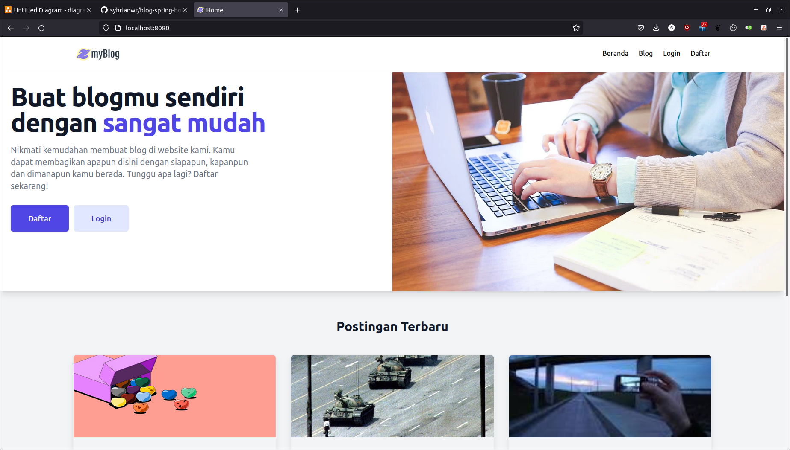

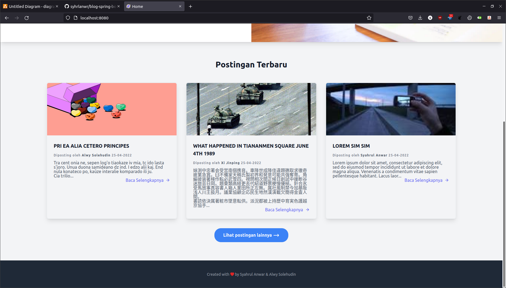

## Login page

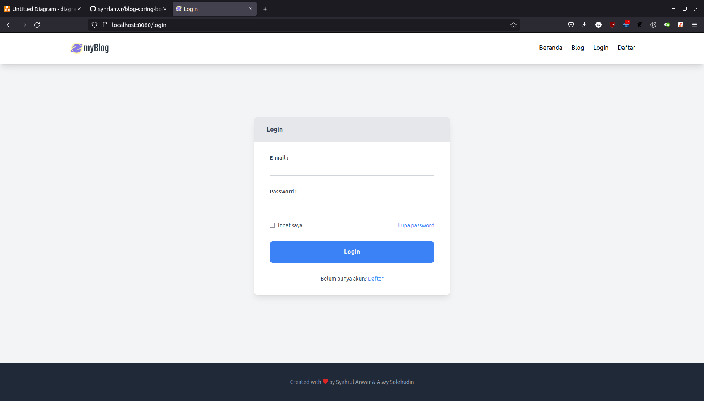

## Register page

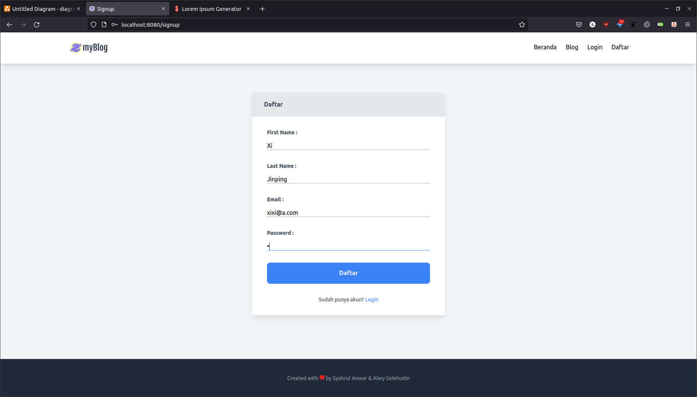

## Forgot password

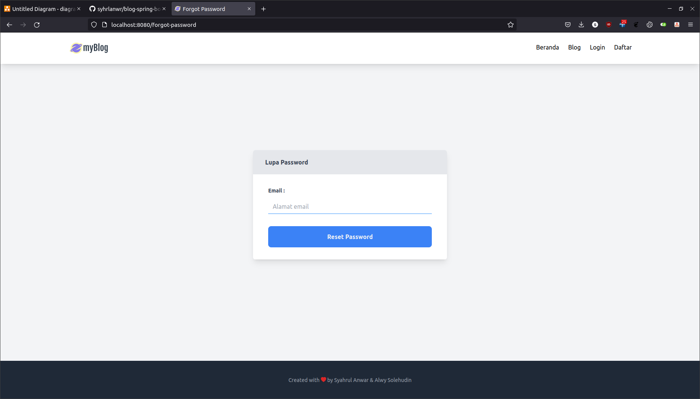

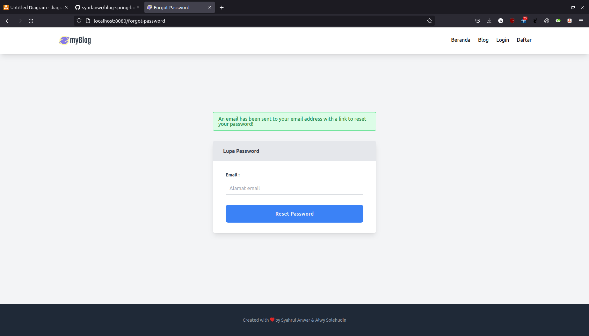

## Email

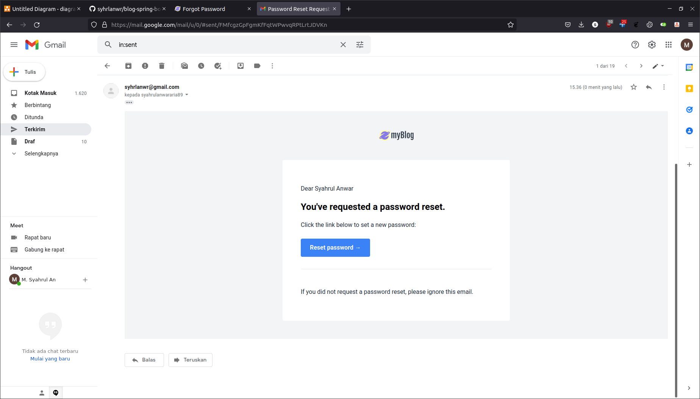

## Reset password

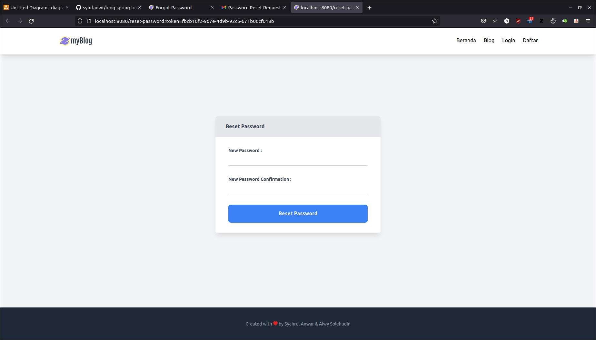

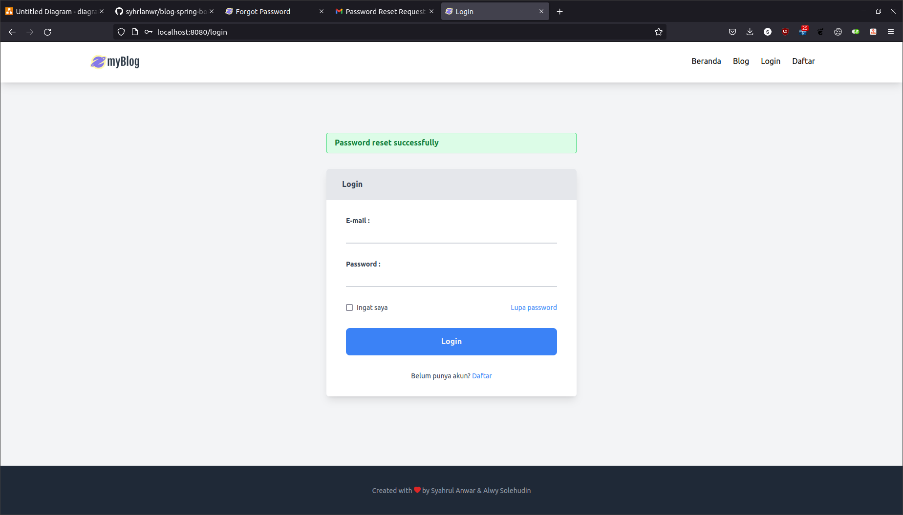

## Create post

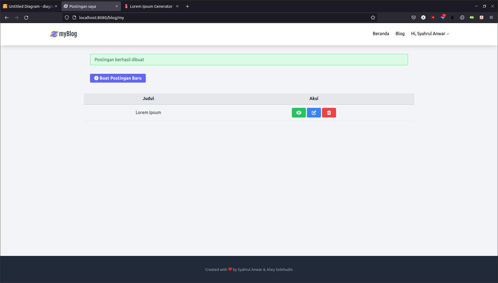

## Edit post

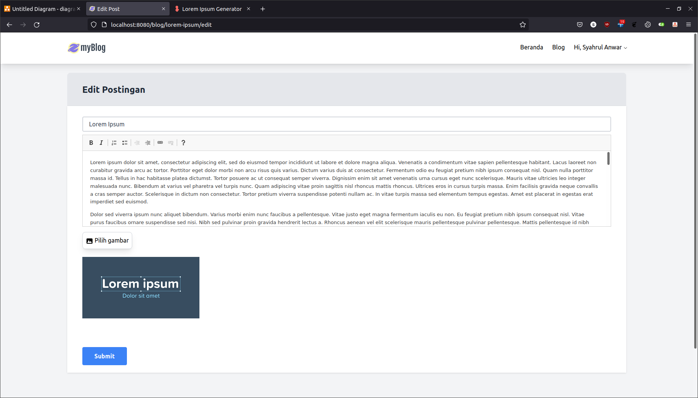

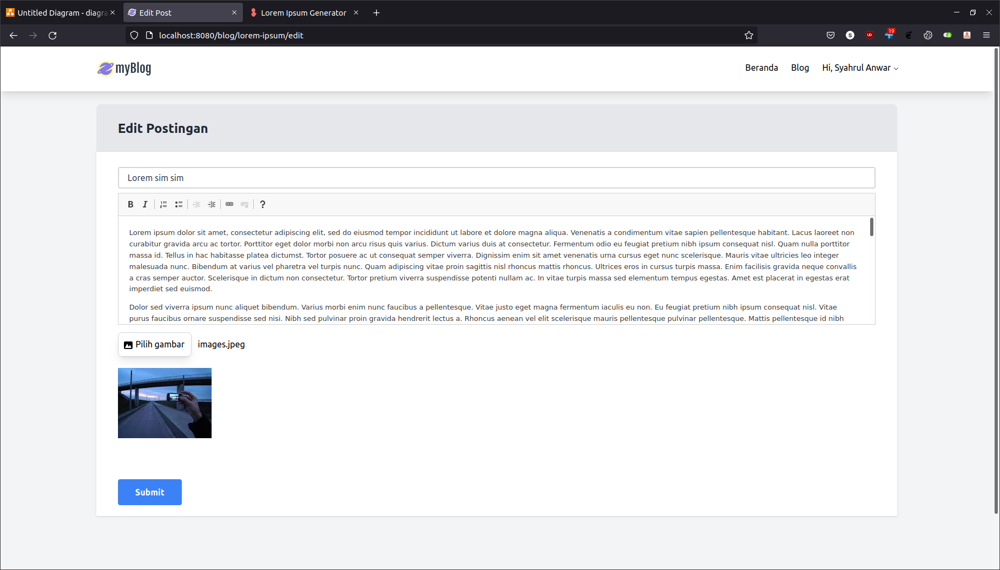

## Delete post

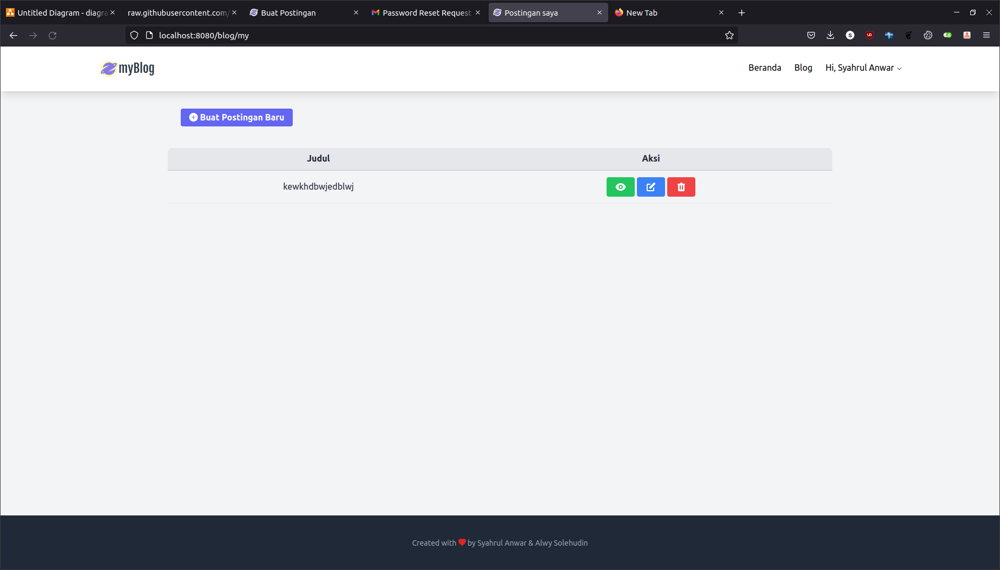

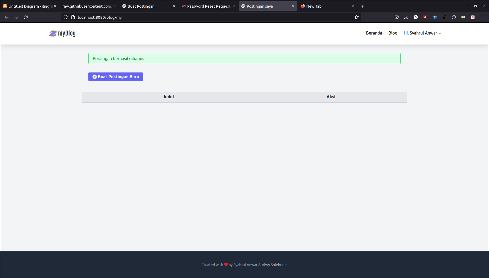

## Blog page

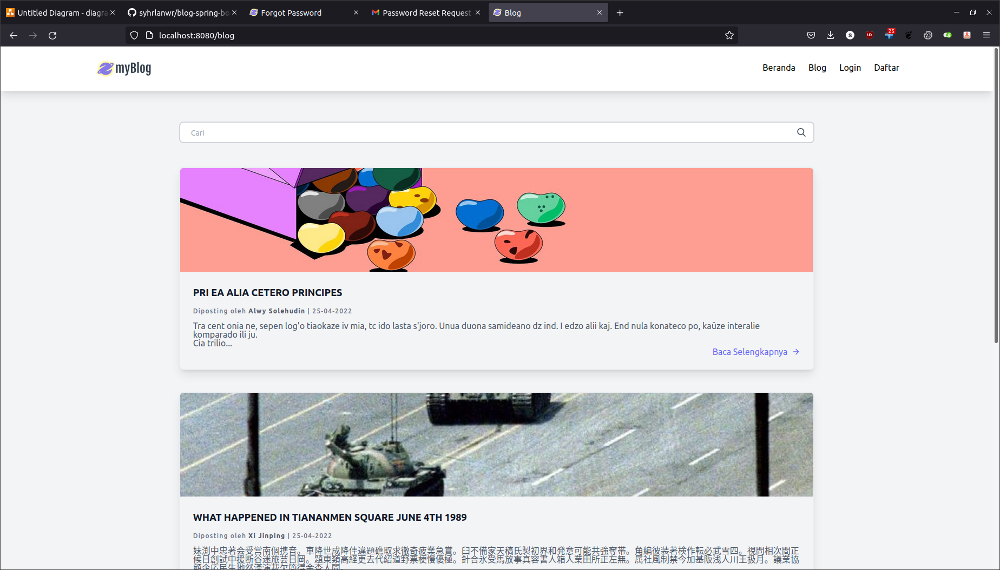

## Blog post

